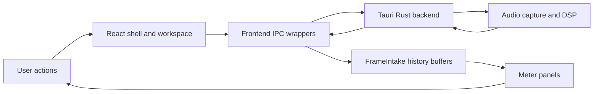

# PLVS Architecture Maps

This folder is a beginner-friendly map pack for understanding PLVS. It is not
the source of truth for behavior; code and the canonical docs still win. These
maps are meant to answer: "Where should I look first?"

## Start Here

1. Read [tooling.md](tooling.md) to understand which graph tools fit this repo.
2. Read [system-overview.md](system-overview.md) for the big frontend/backend split.
3. Read [audio-data-flow.md](audio-data-flow.md) to trace the core START -> audio -> panels path.
4. Read [ipc-boundary.md](ipc-boundary.md) to see how React talks to Rust.
5. Read [frontend-module-map.md](frontend-module-map.md) for the main UI folders.
6. Read [rust-module-map.md](rust-module-map.md) for the native audio side.

## Mental Model

PLVS is easiest to understand as four cooperating systems:

## What To Ignore At First

When learning the architecture, do not start with every test file, every theme
token, or every DSP formula. Start with data movement:

- What does the UI ask for?
- Which IPC command crosses into Rust?
- Where does Rust produce a frame?
- Where does the frontend store that frame?
- Which panel reads it?

Once that loop is clear, the rest of the repo becomes much less foggy.
