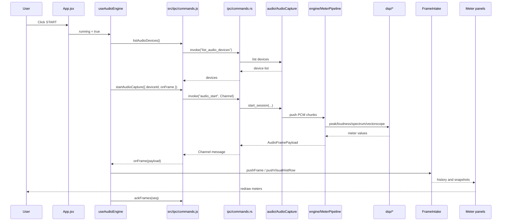
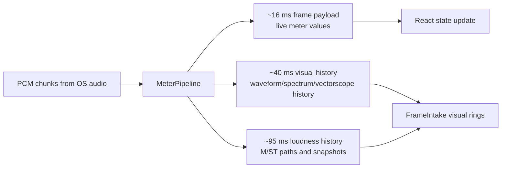

# Audio Data Flow

This is the most important runtime path in PLVS.

## Key Timing

## Why FrameIntake Exists

`FrameIntake` keeps high-frequency audio history out of scattered React state.
It owns ring buffers for loudness, waveform, spectrum, vectorscope, channel
metadata, and snapshot lookup. Without it, every panel would need to duplicate
history logic.

## Debugging Tip

When a panel looks wrong, ask which stage is wrong:

1. Rust did not produce the expected value.
2. IPC payload is correct, but frontend intake stored it incorrectly.
3. Intake is correct, but the panel selected the wrong snapshot/request key.
4. Panel rendering math is wrong.
