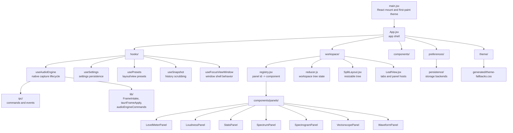

# Frontend Module Map

## Folder Roles

| Folder | Role |
| --- | --- |
| `components/` | Reusable UI and panel components |
| `components/panels/` | The actual meters the user sees |
| `hooks/` | Lifecycle and side effects |
| `ipc/` | The only frontend path into Tauri |
| `lib/` | Shared runtime helpers and frame/history logic |
| `math/` | Pure display math |
| `preferences/` | UI preference parsing and application |
| `persistence/` | Storage backend abstraction |
| `theme/` | Built-in/custom theme definitions and token derivation |
| `workspace/` | Split-pane layout, panel instances, and tab routing |

## Beginner Reading Order

1. `src/App.jsx`
2. `src/workspace/registry.jsx`
3. `src/hooks/useAudioEngine.js`
4. `src/lib/FrameIntake.js`
5. One panel, such as `src/components/panels/LoudnessPanel.jsx`

Do not try to read every panel at once. They share patterns.
