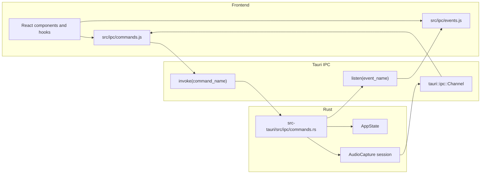

# IPC Boundary

All frontend-to-Rust calls should go through `src/ipc/commands.js`. UI code
should not import `@tauri-apps/api` directly.

## Command Map

| Frontend wrapper | Rust command | Main purpose |
| --- | --- | --- |
| `listAudioDevices()` | `list_audio_devices` | Enumerate capture/loopback devices |
| `previewAudioDevice(deviceId)` | `preview_audio_device` | Resolve label/sample rate/channel count |
| `startAudioCapture(...)` | `audio_start` | Start native capture and open frame channel |
| `stopAudioCapture()` | `audio_stop` | Stop native capture |
| `ackFrames(seq)` | `ack_frames` | Tell Rust which frames the UI processed |
| `clearAudioHistory()` | `clear_audio_history` | Clear native DSP history and peaks |
| `getEngineState()` | `get_engine_state` | Ask whether capture is running |
| `setAnalysisRequests(requests)` | `set_analysis_requests` | Tell Rust which per-panel analysis streams are active |
| `setLoudnessWeights(weights)` | `set_loudness_weights` | Configure loudness channel weights |
| `setDialogueGating(enabled)` | `set_dialogue_gating` | Toggle dialogue-gated loudness |

## Event Map

| Frontend listener | Rust event | Main purpose |
| --- | --- | --- |
| `onDeviceListChanged` | `device-list-changed` | Device list changed |
| `onEngineStateChanged` | `engine-state-changed` | Capture started/stopped/error |
| `onSampleRateChanged` | `sample-rate-changed` | Active device sample rate changed |
| `onMeterHistoryCleared` | `meter-history-cleared` | Native history was cleared |

## Rule Of Thumb

If a new feature needs native capability, add a small wrapper in
`src/ipc/commands.js` first, then implement the matching Rust command. That
keeps the Tauri boundary visible and testable.
