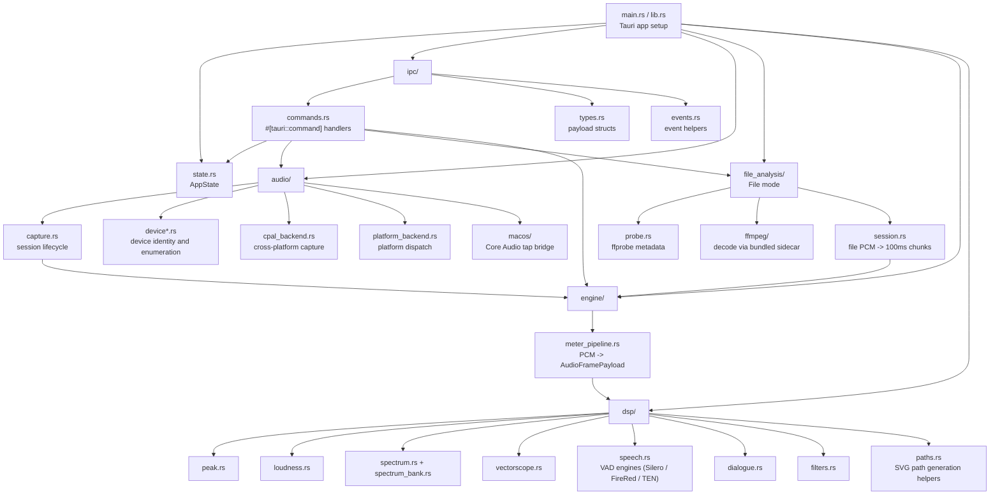

# Rust Module Map

## Native Runtime Story

1. Tauri starts and registers command handlers.
2. The frontend calls `audio_start`.
3. `commands.rs` creates a capture session and stores it in `AppState`.
4. The capture layer reads PCM from the selected device.
5. `MeterPipeline` converts PCM into `AudioFramePayload`.
6. The payload is sent to the frontend over a Tauri Channel.

**File mode** reuses the same pipeline: instead of a live device, `file_analysis/` probes the file
(ffprobe), decodes it via the bundled FFmpeg sidecar, and `session.rs` regulates the decoded PCM into
fixed 100 ms chunks fed through `MeterPipeline` — so history length depends on media duration, not on
the source chunk size.

## Most Useful Rust Files

| File | Why it matters |
| --- | --- |
| `src-tauri/src/ipc/commands.rs` | The Rust side of frontend commands |
| `src-tauri/src/ipc/types.rs` | Shared payload shapes |
| `src-tauri/src/audio/capture.rs` | Capture session lifecycle |
| `src-tauri/src/audio/cpal_backend.rs` | Device/capture backend |
| `src-tauri/src/engine/meter_pipeline.rs` | Core audio frame assembly |
| `src-tauri/src/file_analysis/session.rs` | File mode: decode + 100 ms chunking into the pipeline |
| `src-tauri/src/dsp/loudness.rs` | Loudness calculation |
| `src-tauri/src/dsp/spectrum.rs` | Spectrum calculation |
| `src-tauri/src/dsp/vectorscope.rs` | Vectorscope calculation |

## Beginner Reading Order

1. `src-tauri/src/ipc/commands.rs`
2. `src-tauri/src/audio/capture.rs`
3. `src-tauri/src/engine/meter_pipeline.rs`
4. `src-tauri/src/ipc/types.rs`
5. One DSP module at a time
