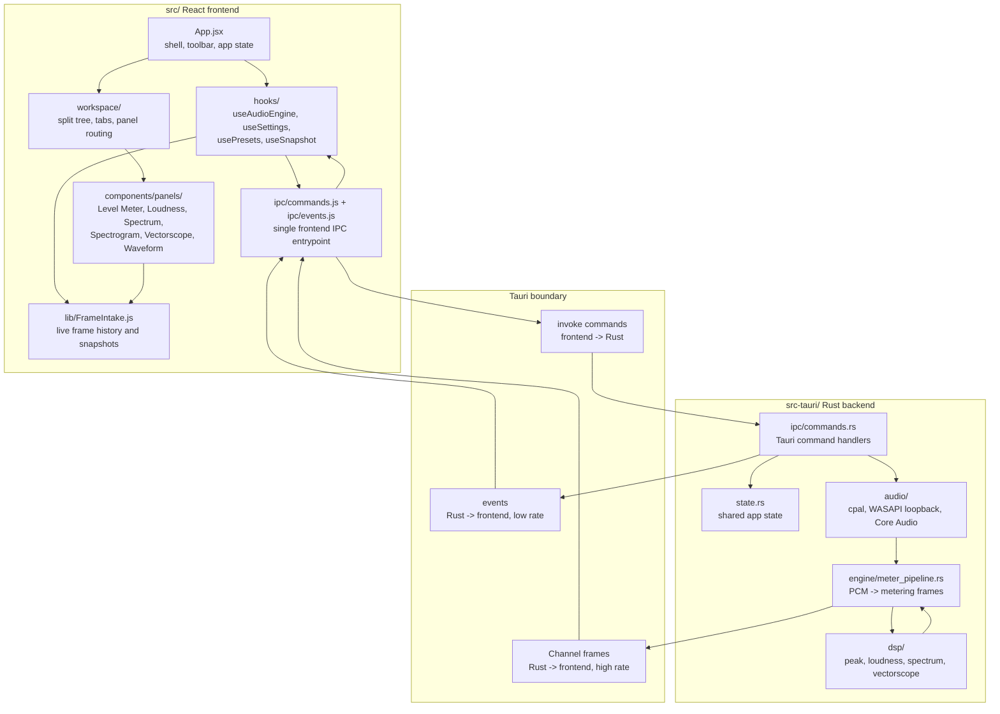

# System Overview

PLVS is a desktop audio metering app. The user sees React panels, but the actual
audio capture and DSP work happen in Rust through Tauri.

## Read This As A Story

The UI does not capture audio directly. It asks Rust to start capture through
`src/ipc/commands.js`. Rust owns the capture session, computes meter frames,
and pushes those frames back to the frontend. The frontend stores recent frames
in `FrameIntake`, and panels render from that shared history.

## First Files To Open

- `src/App.jsx`: top-level app state and wiring.
- `src/hooks/useAudioEngine.js`: start/stop and frame subscription lifecycle.
- `src/ipc/commands.js`: frontend command names.
- `src-tauri/src/ipc/commands.rs`: Rust command handlers.
- `src-tauri/src/engine/meter_pipeline.rs`: core PCM-to-metering conversion.
- `src/lib/FrameIntake.js`: frontend history buffers.
